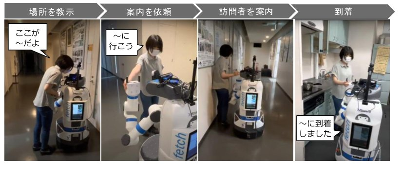
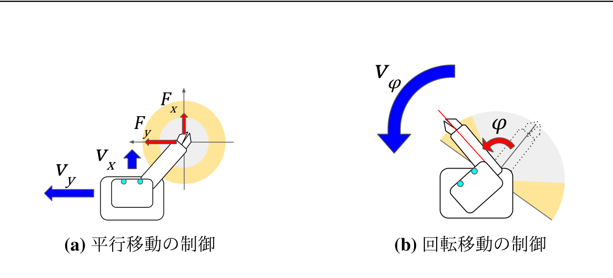

手を繋ぐという自然な接触インタラクションを通じて、ロボットが人を案内するシステムの研究です。
人がロボットの手を引いて先導しながら場所の名前を教えることで、ロボット自身が移動経路と場所を学習し、その後は**人と手を繋いだまま**覚えた場所へ自律的に案内できるようになります。
手繋ぎには、人と手を繋ぐために開発した五指ロボットハンド（[近接・力覚で握り状態を推定する五指ロボットハンド]()）を用い、接触を伴う案内が利用者に与える心理的な安心感を実験的に検証しました。

## 研究背景
空港やショッピングモールなどで案内ロボットの導入が進んでいますが、従来の案内は音声やジェスチャ、人がロボットの後ろを付いていく形式が中心で、ロボットの物理的な身体は十分に活かされていませんでした。
一方、人同士の接触にはストレスを低減する効果があり、人とロボットの手繋ぎでも親密度が向上することが知られています。

また、オフィスや研究室のような業務施設での案内では、「〇〇先生の部屋」のように住所として一意に定まらない呼び方について、ロボットと人が共通認識を持つ必要があります。
そこで本研究では、手繋ぎを次の2つの役割で活用する案内システムを提案しました。

1. **場所の教示手段としての手繋ぎ**: 人がロボットの手を引いて先導し、誰でも簡単に任意の名前で案内場所を追加できる
2. **案内中のコミュニケーション手段としての手繋ぎ**: 案内時にロボットから人へ手を差し出して繋ぎ、安心感を与えつつ、人が手を引いて進路を修正することもできる

## 仮想外力を用いた手引きによる移動制御
使用したロボット（PR2）は手先に力覚センサを持たないため、仮想仕事の原理に基づき、ヤコビ行列と関節トルク指令値から手先にかかる外力（**仮想外力**）を推定しました（τ = −JTf）。
推定した力はベース座標系に変換し、モータ電流の変動や発進・停止時の手先の振動を抑えるため移動平均で平滑化した上で、速度指令値に変換します。

速度指令の計算方法として、以下の3種類を実装・比較しました。

- **慣性なし**: 手を引いている間のみ、力の大きさに応じた速度で移動。速度を力の対数に比例させることで、小さな力でも十分に動き、誤って強く引いた場合も速度が抑えられる
- **慣性あり**: 力に応じて加速度を決め、停止・加速・減速・等速の4状態を遷移。目標速度まで加速したら力を抜いても等速で進み続けるため、手が疲れにくい
- **慣性+粘性あり**: 等速状態で時間経過とともに指数関数的に減速。意図しない外力で動き出しても自然に停止する

廊下での比較実験の結果、慣性なしでは人の力の細かい変動がそのまま速度に表れて操作しにくく、慣性ありでは減速が遅れて壁に衝突しかけることがありました。
場所の教示では教えたい地点で頻繁に止まる必要があるため、目的地の少し手前で力を抜くだけで停止できる**慣性+粘性ありの制御**が最も適していることがわかりました。

## 人の教示による地図生成
先導中、ロボットは以下の2種類の地図を同時に作成します。

- **環境地図**: LiDARの点群からSLAM（gmapping）で生成する2次元の占有格子地図。自律移動時の障害物地図や自己位置推定に使用
- **座標地図**: ロボットが通過した座標をノード、その間の経路をエッジとする無向グラフ。既存のノードに近い地点を再び通過した場合は同一地点とみなしてエッジを接続

人が「ここが〇〇だよ」と話しかけると、音声認識結果から場所の名前を抽出してその場の座標と対応づけ、「〇〇というのですね」と復唱します。
聞き間違えた場合は「違います」で取り消せるほか、「〇〇には△△があります」のように場所の説明を教えると、案内時にロボットが読み上げます。

案内時は、目的地の名前に一致するノードを座標地図から探索し、現在地からの経由点を順に辿って自律移動します。
手を繋いで横を歩く人をLiDARの点群から検出（DR-SPAAM）し、障害物ではなく一緒に歩く相手として点群から除去するとともに、人へ伸ばした腕や人の占める領域を含めたフットプリントで経路計画することで、人と並んで歩ける経路を生成します。

## エレベータを利用した階をまたぐ移動
環境地図と座標地図は階ごとに作成・保存し、「〇階に到着したよ」という音声指示で切り替えます。
各階の地図はエレベータの位置を基準に対応づけられ、目的地が別の階にある場合は「現在地→現在階のエレベータ」「目的階のエレベータ→目的地」の経路をそれぞれ探索します。

**エレベータの教示**では、人がロボットの手を引いてエレベータに乗せ、以下の位置を順に教えます。

1. エレベータ外の待機場所（「ここがエレベータだよ」）
2. 腕を畳む乗降位置（「腕を畳んで」）
3. かご内の待機場所（「左」「後ろ」などの音声で位置を微調整し「ここです」）
4. 到着階でのエレベータ外の待機場所

**案内時のエレベータ利用**では、エレベータ前で一度手繋ぎを中断し、人がボタンを押している間にロボットが先に乗り込みます。
ロボットは腕でドアを押さえ、頭部カメラで人が乗り込んだことを確認してからドアを離し、到着階では人が降りるまで再びドアを押さえます。
降りた後は再び人と手を繋いで目的地への案内を再開します。

このように、手繋ぎを状況に応じて開始・中断・再開しながら、人を支援する行動を案内の中に組み込みました。

## 心理的安心感の評価実験
手繋ぎが案内に与える影響を調べるため、ロボットがエレベータホールから研究室まで人を案内する様子を、**手繋ぎなし**（腕を畳んで先導）と**手繋ぎあり**（手を差し出し、人が握ると握り返して案内）の2条件で撮影し、100名の参加者にオンラインで視聴してもらいました（有効回答97名）。
順序効果を抑えるため、参加者を半数ずつ視聴順の異なる2グループに分けています。

  
  

左: 手繋ぎなし（Condition A）、右: 手繋ぎあり（Condition B）

ヒューマノイドに対する心理的安心感尺度を用い、快適さ（Comfort）・安心（Peace of mind）・性能感（Performance）・制御可能性（Controllability）・ロボットらしさ（Robot-likeness）の5因子を7件法で評価した結果、以下の傾向が得られました。

- 快適さ（3.63→3.74）・性能感（4.30→4.49）で手繋ぎ条件がやや高い評価となる傾向（有意差なし）
- どちらのロボットが有能に見えるかという質問では、57名が手繋ぎありのロボットを選択（手繋ぎなしは40名）。「気遣いができる」「優しさを感じる」といった理由が多く挙げられた
- 一方、制御可能性（4.49→4.38）の評価は低下する傾向。自律的に動くロボットと手が繋がっていることで、暴走時に手を離してもらえないといった危険を感じた可能性がある
- ロボットが手を差し出す動作のみを見せて意図を尋ねたところ、41名が「手繋ぎ」と回答し、案内や手助けと答えた人の多くも手を繋ぎ返すと回答。手繋ぎの意図が自然に伝わることを確認

また、「このロボットと手を繋ぎたいか」という質問には44名が「はい」と回答し、ロボットの握り心地への興味や親しみ・安心感が理由に挙がりました。
「いいえ」の理由としてはハンドの見た目が硬くゴツゴツしていることが多く挙げられ、柔らかい外装など、安心感に繋がるハンドの外観が今後の課題として明らかになりました。

## 関連論文

- 中根葵, 矢野倉伊織, 東風上奏絵, 岡田慧, 稲葉雅幸: 人の先導と場所教示をもとに案内行動を獲得するロボットの手繋ぎ誘導システム. *日本ロボット学会学術講演会*, 4D1-04, 2022.
- Aoi Nakane, Iori Yanokura, Aiko Ichikura, Kei Okada, Masayuki Inaba: Development of Robot Guidance System Using Hand-holding with Human and Measurement of Psychological Security. *IEEE International Symposium on Robot and Human Interactive Communication*, pp.2030-2036, 2023.
