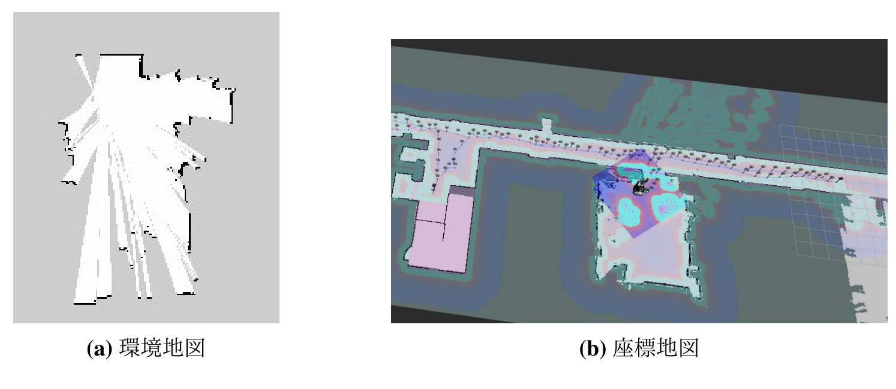
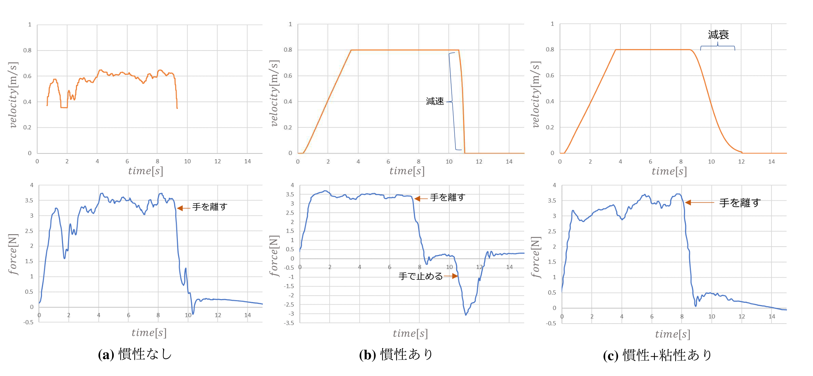
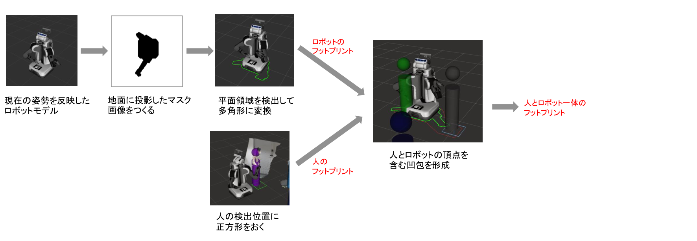
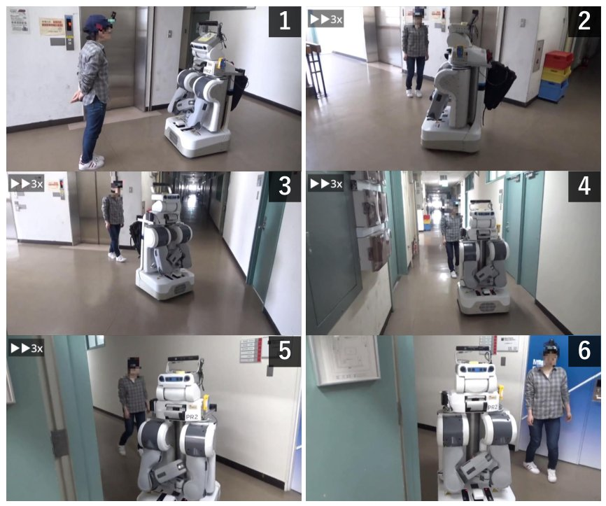
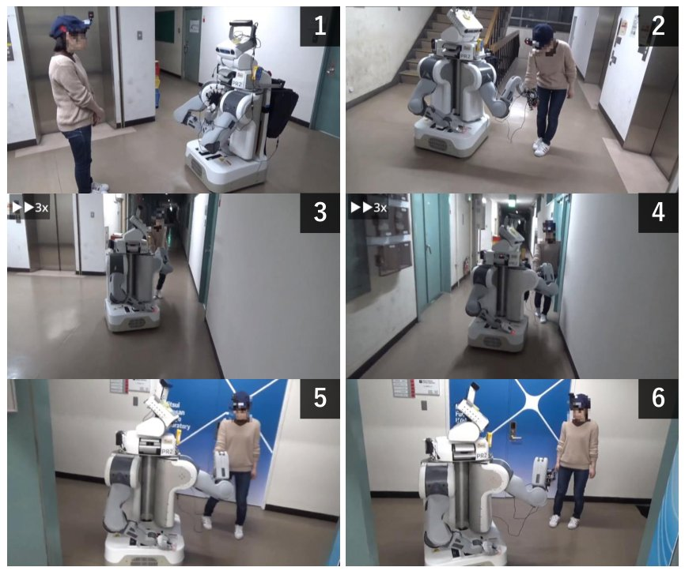

## 研究背景
手繋ぎには，安心感を与える心理的な役割や，直感的な指示方法としての実用的な役割があります．
また，対称的で両者が主導することが可能です
そこで本研究では、次の2つのフェーズからなるロボットによる案内システムを提案します．
- 人間による場所教示: 人間がロボットの手を引いて先導しながら、ロボットに場所の名前と移動経路を教える
- ロボットによる案内: 人間が目的地を伝えると、ロボットが人間の手を引いてその場所へ案内する

## 人の教示による地図生成
先導中、ロボットは以下の2種類の地図を同時に作成します。

- **環境地図**: LiDARの点群からSLAM（gmapping）で生成する2次元の占有格子地図。自律移動時の障害物地図や自己位置推定に使用
- **座標地図**: ロボットが通過した座標をノード、その間の経路をエッジとする無向グラフ。既存のノードに近い地点を再び通過した場合は同一地点とみなしてエッジを接続

人が「ここが〇〇だよ」と話しかけると、音声認識結果から場所の名前を抽出してその場の座標と対応づけ、「〇〇というのですね」と復唱します。
聞き間違えた場合は「違います」で取り消せるほか、「〇〇には△△があります」のように場所の説明を教えると、案内時にロボットが読み上げます。

## 人間の手引きによる移動制御
教示時に、ロボットの手先にかかる外力（モータ電流値から推定）を移動速度に変換する方法として、3種類のモデルを考案しました。

1. **慣性なし**: 速度を手先外力の対数に比例させる
2. **慣性あり**: 力に応じて加速度を決め、閾値との大小関係で停止・加速・減速・等速の4状態を遷移させる
3. **慣性+粘性あり**: 2の等速状態で時間に応じて指数関数的に減速させる

比較実験の結果、1では人の力の細かい変動が頻繁な速度変化に表れて操作しにくく、2では逆方向に力をかけて減速させるのが遅れ，壁に衝突しかけることがありました。
教示中に各場所で頻繁に止まるためには、目的地の少し手前で力を抜くだけで停止できる**3.慣性+粘性あり**の制御が適していることがわかりました。

## 案内
案内時は、目的地の名前に一致するノードを座標地図から探索し、現在地からの経由点を順に辿って自律移動します。
手を繋いで横を歩く人をLiDARの点群から検出（DR-SPAAM）し、障害物ではなく一緒に歩く相手として点群から除去するとともに、人へ伸ばした腕や人の占める領域を含めたフットプリントで経路計画することで、人と並んで歩ける経路を生成します。

## エレベータを利用した階をまたぐ移動
環境地図と座標地図は階ごとに作成・保存し、「〇階に到着したよ」という音声指示で切り替えます。
各階の地図はエレベータの位置を基準に対応づけられ、目的地が別の階にある場合は「現在地→現在階のエレベータ」「目的階のエレベータ→目的地」の経路をそれぞれ探索します。

**エレベータの教示**では、人がロボットの手を引いてエレベータに乗せ、以下の位置を順に教えます。

1. エレベータ外の待機場所（「ここがエレベータだよ」）
2. 腕を畳む乗降位置（「腕を畳んで」）
3. かご内の待機場所（「左」「後ろ」などの音声で位置を微調整し「ここです」）
4. 到着階でのエレベータ外の待機場所

案内時のエレベータ利用では、エレベータ前で一度手繋ぎを中断し、人がボタンを押している間にロボットが先に乗り込みます。
ロボットは腕でドアを押さえ、頭部カメラで人が乗り込んだことを確認してからドアを離し、到着階では人が降りるまで再びドアを押さえます。
降りた後は再び人と手を繋いで目的地への案内を再開します。

## 心理的安心感の評価実験
手繋ぎが案内に与える影響を調べるため、ロボットがエレベータ前から研究室まで人間を案内する様子を、手繋ぎなしと手繋ぎありの2条件で撮影し、100名の参加者によるオンラインアンケートを実施しました（有効回答97名）。

ヒューマノイドに対する心理的安心感尺度を用い、Comfort・Peace of mind・Performance・Controllability・Robot-likenessの5因子を7件法で評価した結果、以下の傾向が得られました。

  
  

左: 手繋ぎなし（Condition A）、右: 手繋ぎあり（Condition B）

- 快適さ（3.63→3.74）・性能感（4.30→4.49）で手繋ぎ条件がやや高い評価となる傾向（有意差なし）
- どちらのロボットが有能に見えるかという質問では、57名が手繋ぎありのロボットを選択（手繋ぎなしは40名）。「気遣いができる」「優しさを感じる」といった理由が多く挙げられた
- 一方、制御可能性（4.49→4.38）の評価は低下する傾向。自律的に動くロボットと手が繋がっていることで、暴走時に手を離してもらえないといった危険を感じた可能性がある
- ロボットが手を差し出す動作のみを見せて意図を尋ねたところ、41名が「手繋ぎ」と回答し、案内や手助けと答えた人の多くも手を繋ぎ返すと回答。手繋ぎの意図が自然に伝わることを確認

また、「このロボットと手を繋ぎたいか」という質問には44名が「はい」と回答し、ロボットの握り心地への興味や親しみ・安心感が理由に挙がりました。
「いいえ」の理由としてはハンドの見た目が硬くゴツゴツしていることが多く挙げられ、柔らかい外装など、安心感に繋がるハンドの外観が今後の課題として明らかになりました。

## 関連論文

- 中根葵, 矢野倉伊織, 東風上奏絵, 岡田慧, 稲葉雅幸: 人の先導と場所教示をもとに案内行動を獲得するロボットの手繋ぎ誘導システム. *日本ロボット学会学術講演会*, 4D1-04, 2022.
- Aoi Nakane, Iori Yanokura, Aiko Ichikura, Kei Okada, Masayuki Inaba: Development of Robot Guidance System Using Hand-holding with Human and Measurement of Psychological Security. *IEEE International Symposium on Robot and Human Interactive Communication*, pp.2030-2036, 2023.
