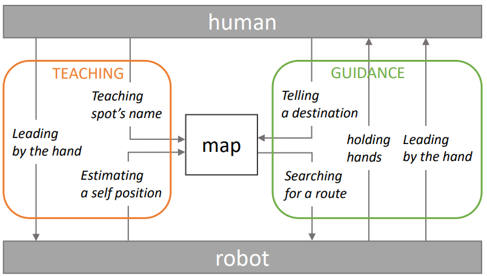
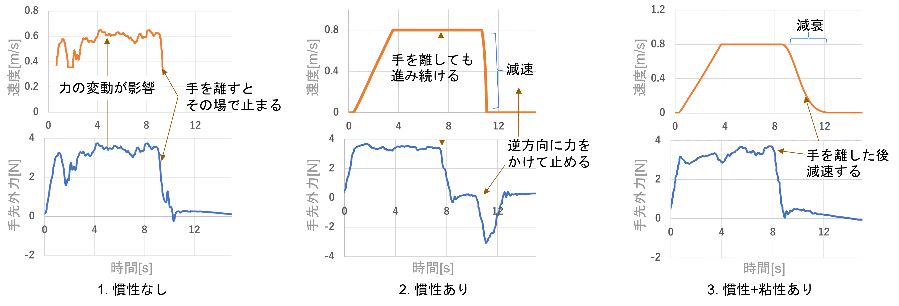
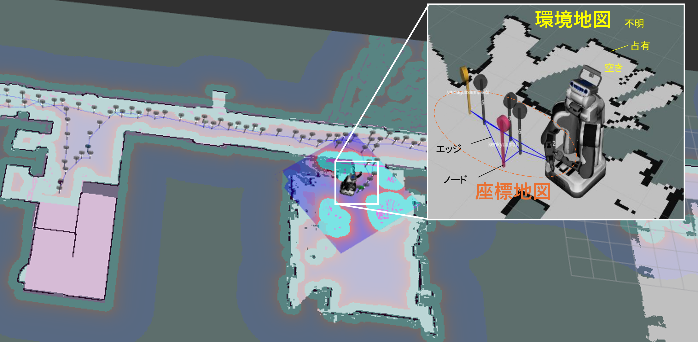
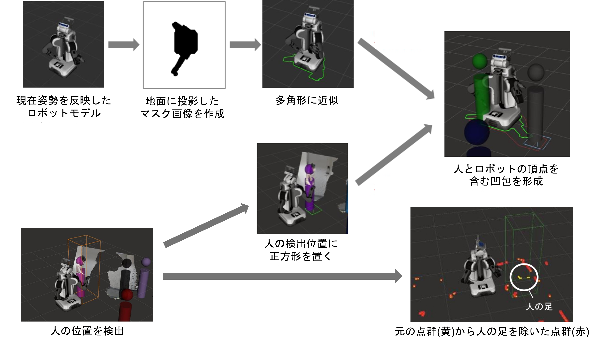
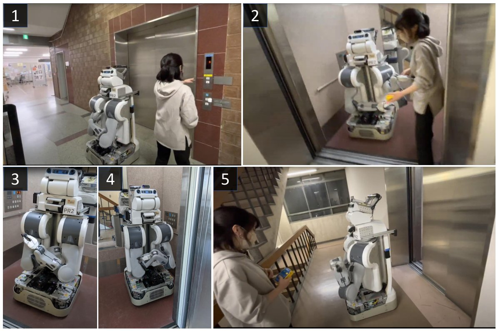
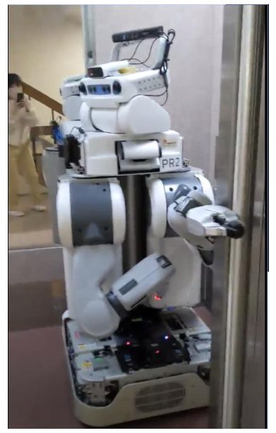
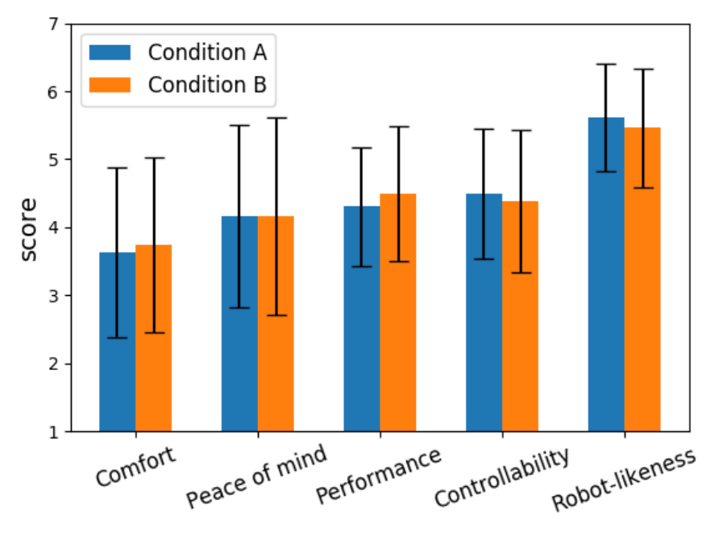

## 研究背景
手繋ぎには、安心感を与える心理的な役割と、直感的に指示ができる実用的な役割があります。また、状況に応じて双方が主導権を握れる（対称的な操作が可能である）という利点もあります。

そこで本研究では、この手繋ぎの特性を活かし、次の2つのフェーズからなる案内ロボットシステムを提案します。
- 人間による場所教示: 人間がロボットの手を引いて先導し、経路と場所の名前を教える
- ロボットによる案内: 人間が目的地を伝えると、ロボットが人間の手を引いて目的地へ案内する

## 人間の手引きによる移動制御
人間がロボットの手を引いたときに、ロボットの手先にかかる外力（モータ電流値から推定）を移動速度に変換する方法として、3種類のモデルを考案しました。

1. **慣性なし**: 速度を手先外力の対数に比例させる
2. **慣性あり**: 力に応じて加速度を決め、閾値との大小関係で停止・加速・減速・等速の4状態を遷移させる
3. **慣性+粘性あり**: 2の等速状態に、時間に応じた指数関数的な減速を追加

比較実験の結果、1では人の力の細かい変動が頻繁な速度変化に表れて操作しにくく、2では逆方向に力をかけて減速させるのが遅れ，壁に衝突しかけることがありました。
教示中に各場所で頻繁に止まるためには、目的地の少し手前で力を抜くだけで停止できる**3.慣性+粘性あり**の制御が適していることがわかりました。

<video width="90%" controls>
  <source src="figs/roman6.mp4" type="video/mp4">
  Your browser does not support the video tag.
</video>

## 人間の教示による地図生成
人間がロボットを先導している間、ロボットは以下の2種類の地図を自動で生成します。

- **環境地図**: LiDARのデータに基づき、2次元格子にコストを割り当てた地図。自律移動時の障害物回避や自己位置推定に利用
- **座標地図**: ロボットが通過した座標をノード、その間の経路をエッジとする無向グラフ。このグラフをロボットが通行可能な経路として扱う

移動中の座標は定期的に記録されます。特に人間が「ここが〇〇だよ」と話しかけると、場所の名前を抽出し、その時の座標と紐付けて登録します。
		

## 手繋ぎロボットによる案内
人間が「〇〇に連れて行って」と依頼すると、ロボットは作成した座標地図を用いて目的地までの経路を探索します。経路が見つかると人間と手を繋ぎ、経由点を辿って目的地まで移動します。

案内中、ロボットは人間と安全に並んで歩くために以下の工夫を行っています。
- パートナーの認識: LiDARの点群から手を繋いで隣を歩く人間を認識し、他の障害物と区別
- 人間と一体化した障害物回避: ロボット・人間へ伸ばしたアーム・人間を合成したフットプリントを形成し、これが障害物と干渉しないような経路を計画

## エレベータを利用した階をまたぐ移動
環境地図と座標地図は階ごとに作成・保存し、「〇階に到着したよ」という音声指示で切り替えます。
各階の地図はエレベータの位置を基準に対応づけられ、目的地が別の階にある場合は現在地→現在階のエレベータ、目的階のエレベータ→目的地の経路をそれぞれ探索します。

**エレベータの教示**では、人がロボットの手を引いてエレベータに乗せ、以下の位置を順に教えます。

1. エレベータ外の待機場所（「ここがエレベータだよ」）
2. 腕を畳む乗降位置（「腕を畳んで」）
3. かご内の待機場所（「左」「後ろ」などの音声で位置を微調整し「ここです」）
4. 到着階でのエレベータ外の待機場所

案内時のエレベータ利用では、エレベータ前で一度手繋ぎを中断し、人がボタンを押している間にロボットが先に乗り込みます。
ロボットは腕でドアを押さえ、頭部カメラで人が乗り込んだことを確認してからドアを離し、到着階では人が降りるまで再びドアを押さえます。
降りた後は再び人と手を繋いで目的地への案内を再開します。

## 心理的安心感の評価
ロボットが人間を案内する動画（A: 手繋ぎなし、B: 手繋ぎあり）に対する印象を、100名のオンラインアンケートで評価しました（有効回答97名）。
アンケートでは、ヒューマノイドに対する心理的安心感尺度として提案された「快適さ・安心感・性能感・制御可能性・ロボットらしさ」の5因子についての質問項目を抜粋し、7段階評価を行いました。加えて、自由回答の質問もいくつか追加し、以下の結果が得られました。

- 5因子のうち快適さ・性能感は手繋ぎありがやや高く（有意差なし）、「どちらのロボットが有能に見えるか」という質問では、「気遣いができる」「優しさを感じる」といった理由から過半数（57名）が手繋ぎありを選択
- 制御可能性は手繋ぎありの方が評価が低く、移動ロボットと物理的に繋がることで、暴走時に手を離してもらえないといった不安が生じた可能性
- 「このロボットと手を繋ぎたいか」という質問に対して、ロボットの握り心地への興味や親しみ・安心感といった理由から44名が「はい」と回答。「いいえ」の理由としてはハンドの見た目が硬くゴツゴツしていることが多く挙げられ、柔らかい外装など、安心感を与える外観が今後の課題

<video width="90%" controls>
  <source src="figs/roman5.mp4" type="video/mp4">
  Your browser does not support the video tag.
</video>

## 関連論文

- 中根葵, 矢野倉伊織, 東風上奏絵, 岡田慧, 稲葉雅幸: 人の先導と場所教示をもとに案内行動を獲得するロボットの手繋ぎ誘導システム. *日本ロボット学会学術講演会*, 4D1-04, 2022.
- Aoi Nakane, Iori Yanokura, Aiko Ichikura, Kei Okada, Masayuki Inaba: Development of Robot Guidance System Using Hand-holding with Human and Measurement of Psychological Security. *IEEE International Symposium on Robot and Human Interactive Communication*, pp.2030-2036, 2023.
