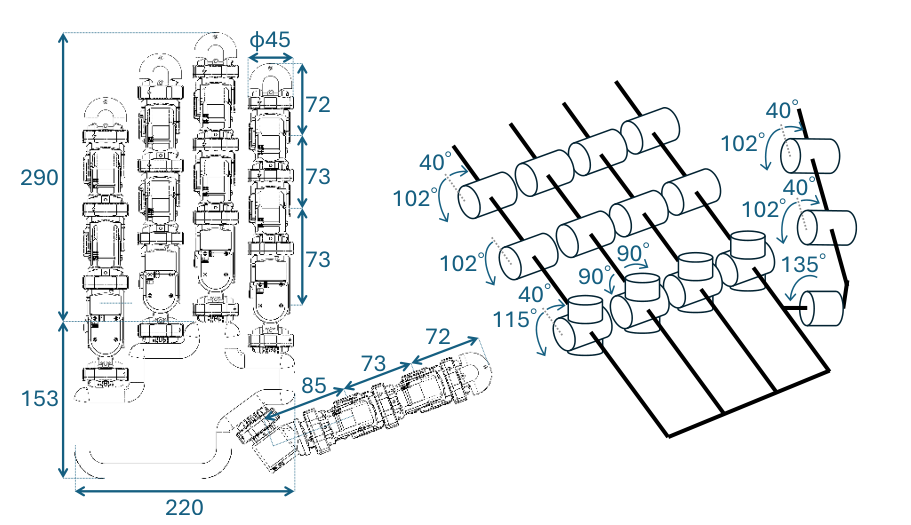

アームから分離して自律移動するロボットハンドは、本体からは届かない机上や人への近接空間へアクセスでき、日常生活における支援可能性を大きく広げます。さらに、人間と同様の五指形状はジェスチャによる意思疎通も期待されます。

本研究では、このような単体で活動するハンドを**ハンドロボット**と呼び、ハンドロボットが**支持・移動、把持、表現という複数機能を統合的に実行する**概念を**ハンドロコマニピュレーション**と名付けました。

## 研究背景
ハンドロコマニピュレーションにおいて、指や掌は地面を支える脚や物体を掴む腕のように、タスクに応じてその役割を動的に変化させます。
しかし、指や掌同士が近接しているため、各機能は幾何学的・力学的に切り離せないという特有の課題があります。

- 相補的な連携: 近接した部位同士が協調して複数機能を同時に発揮できる
- 機能間の干渉: ある指の動きが他の指の動きを妨げる

本研究では、限られた指や掌に複数の役割をどう分担できるかを評価するために、**機能の複合形態の体系的分類**に取り組みました。

## 基本形態の定義
支持・把持・表現の各機能を単独で実現する姿勢を基本形態、これらを組み合わせた姿勢を複合形態とし、

- **支持形態（5分類）**: 接地部位に応じて、倒立型・放射脚型・縦アーチ型・正立型・尺側型を定義。倒立型・放射脚型・縦アーチ型は指の振り上げと再接地によって移動に展開できる一方、正立型と尺側型は静的な支持に特化した形態
- **把持形態（6分類）**: Schlesingerの分類（指尖つまみ・指腹つまみ・側腹つまみ・筒状握り・球状握り・鉤状握り）を採用し、母指以外の4指を機能的に同等とみなして任意の指の組み合わせを許容
- **表現形態（4分類）**: 喜多のジェスチャ分類を採用。形が厳密に定まる「エンブレム」は全指が関与し、「拍子」「映像的」「直示的」ジェスチャは1本以上の指で実現可能と定義

## 指の配分問題としての組み合わせ可能性評価
各基本形態は、機能に関与する部位（掌・母指・他の指）の個数制約を持つため、その組み合わせ可能性は、ハンドロボットが持つ母指1本と他の指4本を各機能へ分配する問題に帰着できます。
支持・把持・表現に使う母指の数を Ts, Tm, Tg、他の指の数を Fs, Fm, Fg とすると、以下の制約を同時に満たす整数の組が存在するかどうかで判定できます。

Ts + Tm + Tg ≤ 1,&emsp;Fs + Fm + Fg ≤ 4

成立した組み合わせを縦軸に支持形態、横軸に把持・表現形態を配置したマトリクスとして整理し、各セルを実機で再現しました。

## ハンドロボットの実機開発
分類した複合形態の実現可能性を検証するため、重さ1.67 kg、人間の手の約3倍サイズのハンドロボットを製作しました。

- 母指以外の指は3関節の屈曲と内外転で4自由度、母指は3関節の屈曲で3自由度を持ち、計19個のサーボモータで駆動
- 自重によるモータ負荷を防ぐため、樹脂製カバーに突起を設けて可動域を構造的に制限

## 実機による把持と支持の物理的干渉分析

<video width="120%" controls>
  <source src="figs/exp.mp4" type="video/mp4">
  Your browser does not support the video tag.
</video>

## 関連論文

- 中根葵, 山口直也, 矢野倉伊織, 岡田慧: 5指ロボットにおけるタスク駆動型ハンドロコマニピュレーションの身体的役割分担. *SICEシステムインテグレーション部門講演会*, 2B3-09, 2025.
