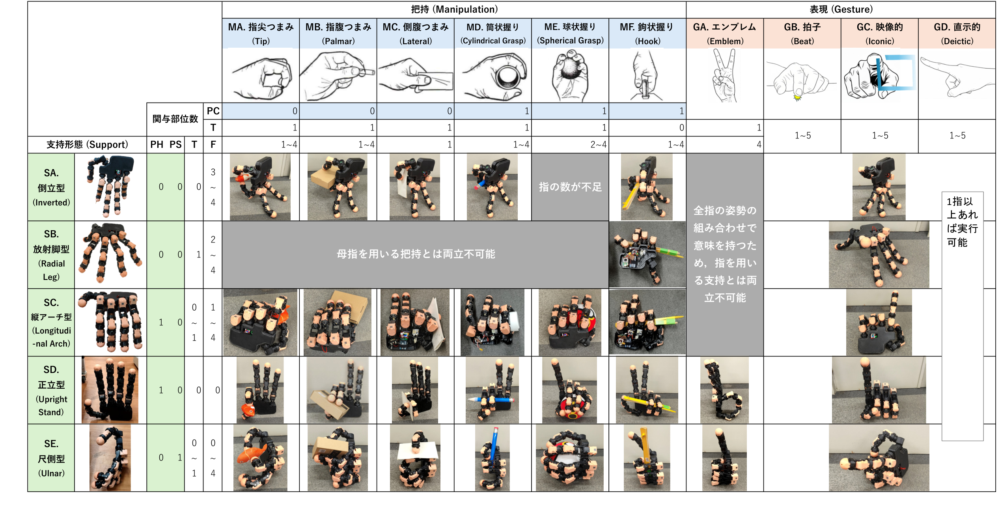

アームから分離し、指を脚のように使って自律移動できるロボットハンドは、本体からは届かない机上や人の近くの空間へアクセスでき、日常生活における物理支援の可能性を大きく広げます。さらに人間と同様の五指形状は、指差しや問いかけへの返答といったジェスチャによる意思疎通も可能にします。
本研究では、このような単体で活動するハンドを「ハンドロボット」と呼び、ハンドロボットが**支持・移動、把持、表現という複数機能を統合的に実行する**概念を「**ハンドロコマニピュレーション**」と名付けました。

## 研究背景
ハンドロコマニピュレーションにおいて、指や掌は地面を支える「脚」や物体を掴む「腕」のように、タスクに応じてその役割を動的に変化させます。
しかし、指や掌同士が近接しているため、各機能は幾何学的・力学的に切り離せないという特有の課題があります。

- 相補的な連携: 近接した部位同士が協調して複数機能を同時に発揮できる
- 機能間の干渉: ある指の動きが他の指の動きを妨げる

人間の把持形態の分類やヒューマノイドの全身接触姿勢の分類のように、ロボット分野では分類学が研究の基盤を築いてきました。そこで本研究では、限られた指や掌に複数の役割をどう分担できるかを評価するために、**機能の複合形態の体系的分類**に取り組みました。

## 基本形態の定義
支持・把持・表現の各機能を単独で実現する姿勢を「基本形態」、これらを組み合わせた姿勢を「複合形態」とし、各基本形態を機能に関与する部位（掌・母指・他の指）の個数制約によって定義しました。

- **支持形態（5分類）**: 接地部位に応じて、倒立型・放射脚型・縦アーチ型・正立型・尺側型を定義。倒立型・放射脚型・縦アーチ型は指の振り上げと再接地によって移動に展開できる一方、正立型と尺側型は静的な支持に特化した形態
- **把持形態（6分類）**: Schlesingerの分類（指尖つまみ・指腹つまみ・側腹つまみ・筒状握り・球状握り・鉤状握り）を採用し、母指以外の4指を機能的に同等とみなして任意の指の組み合わせを許容
- **表現形態（4分類）**: 喜多のジェスチャ分類を採用。形が厳密に定まる「エンブレム」は全指が関与し、「拍子」「映像的」「直示的」ジェスチャは1本以上の指で実現可能と定義

## 指の配分問題としての組み合わせ可能性評価
各基本形態の組み合わせ可能性は、ハンドロボットが持つ**母指1本と他の指4本を各機能へ分配する問題**に帰着できます。
支持・把持・表現に使う母指の数を Ts, Tm, Tg、他の指の数を Fs, Fm, Fg とすると、以下の制約を同時に満たす整数の組が存在するかどうかで判定できます。

Ts + Tm + Tg ≤ 1,&emsp;Fs + Fm + Fg ≤ 4

この評価により、例えば以下のような両立不可能な組み合わせが明らかになります。
- 倒立型（Fs ≥ 3）と球状握り（Fm ≥ 2）は、指の数が不足するため両立しない
- 放射脚型は支持に母指を用いるため、鉤状握り以外の母指を使う把持とは両立しない
- エンブレムは全指の姿勢の組み合わせで意味を持つため、指を用いる支持とは両立しない

成立した組み合わせを縦軸に支持形態、横軸に把持・表現形態を配置したマトリクスとして整理し、各セルを実機で再現しました。

## 19自由度ハンドロボットの開発
分類した複合形態の実現可能性を検証するため、重さ1.67 kg、人間の手の約3倍サイズのハンドロボットを製作しました。

- 母指以外の指は3関節の屈曲と内外転で4自由度、母指は3関節の屈曲で3自由度を持ち、計19個のサーボモータで駆動
- 自重によるモータへの負荷で故障することがあったため、樹脂製カバーに突起を設けて可動域を構造的に制限

## 実機による把持と支持の物理的干渉分析
分類表の複合形態を実機で再現したところ、指の個数制約上は成立する組み合わせであっても、以下の物理的な課題が明らかになりました。

- 支持安定性の問題: 倒立型や正立型は把持に母指を利用しやすい一方、支持多角形が小さいため、大きく重い物体を把持すると転倒することがあった。正立型では支持多角形を広く取れる手首の厚みの考慮、倒立型では動的な姿勢調整による重心制御が必要
- 把持物体と支持部位の幾何学的干渉: 放射脚型や縦アーチ型で大きな物体を把持すると、物体が床面との間に割り込み、支持指の根元が浮き上がって接地が困難になった。また長尺物を把持すると、物体が支持指の動作空間を遮り可動域が著しく制限された

これらは支持と把持の機能が極めて近接した部位で実行されるハンドロボット特有の課題であり、指の資源配分だけでは捉えきれない物理的な制約が存在することを示しています。

## 関連論文

- 中根葵, 山口直也, 矢野倉伊織, 岡田慧: 5指ロボットにおけるタスク駆動型ハンドロコマニピュレーションの身体的役割分担. *SICEシステムインテグレーション部門講演会*, 2B3-09, 2025.
