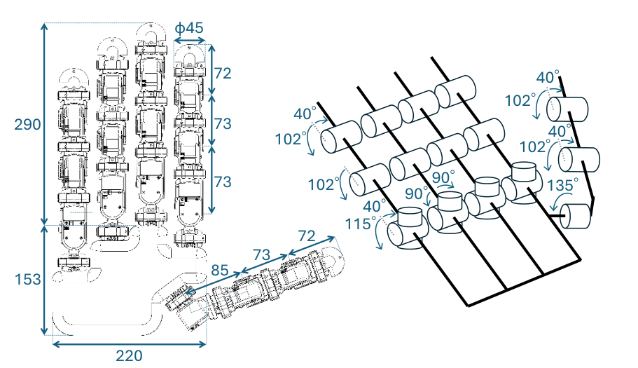

アームから分離して自律移動する**ハンドロボット**は、ロボット本体からは届かない机上や人への近接空間へアクセスでき、5指によるジェスチャと組み合わせて日常生活における支援可能性を大きく広げます。本研究では、このハンドが「支持・移動」「把持」「表現」の複数機能を統合的に実行する概念を**ハンドロコマニピュレーション**と名付けました。

## 研究背景
ハンドロコマニピュレーションでは、地面を支える脚や物体を掴む腕のように、指や掌がタスクに応じて役割を変化させます。しかし、これらの部位は狭い範囲に密集して幾何的・力学的に影響し合うため、機能同士の干渉回避と、1部位での機能兼任を考慮した役割分担が求められます。そこで本研究では、複数機能を実現するハンド形態の体系的な分類に取り組みました。

## 基本形態の定義
ハンドロコマニピュレーションにおける形態は、各機能を単独で実現する以下の基本形態の組み合わせからなると考えました（詳細は下表参照）。

- **支持形態**: 掌・母指・4指のうち、どの部位を接地させるかに応じて分類。正立型と尺側型は指の振り出しによる重心移動が難しく、静的な支持に特化した形態。
- **把持形態**: Schlesingerの把持分類[1919]を採用。本研究では母指以外の4指を機能的に同等とみなし、区別しない。
- **表現形態**: 喜多のジェスチャ分類[1997]を採用。形が厳密に定まるエンブレム（OKサインなど）は全指が関与し、拍子、映像的・直示的ジェスチャ（指差しなど）は1本以上の指で実現可能と定義。

## 基本形態の組み合わせ可能性
基本形態の組み合わせ可能性は、ハンドロボットの母指1本と他指4本を各機能へ配分する問題に帰着します。
支持(s)・把持(m)・表現(g)に使う母指の数(T)と4指の数(F)が、以下の制約を同時に満たすかで判定しました。

Ts + Tm + Tg ≤ 1,&emsp;Fs + Fm + Fg ≤ 4

以下の縦軸に支持形態、横軸に把持・表現形態を配置した分類表において、成立した組み合わせを整理しました。

## ハンドロボットの実機開発
重さ1.67 kg、人間の手の約3倍サイズのハンドロボットを製作し、分類表の各セルの姿勢が可能であることを実機で確認しました。

- 母指以外の指は4自由度、母指は3自由度を持ち、計19個のサーボモータで駆動
- 自重によるモータ負荷を防ぐため、樹脂製カバーに突起を設けて可動域を構造的に制限

さらに、コントローラとしてStream Deckを活用し、各キーに割り当てた支持形態間の遷移や異なる支持形態における移動動作を実現しました。

<video width="120%" controls>
  <source src="figs/exp.mp4" type="video/mp4">
  Your browser does not support the video tag.
</video>

<video width="100%" controls>
  <source src="figs/motion.mp4" type="video/mp4">
  Your browser does not support the video tag.
</video>

## 関連論文

- 中根葵, 山口直也, 矢野倉伊織, 岡田慧: 5指ロボットにおけるタスク駆動型ハンドロコマニピュレーションの身体的役割分担. *SICEシステムインテグレーション部門講演会*, 2B3-09, 2025.
