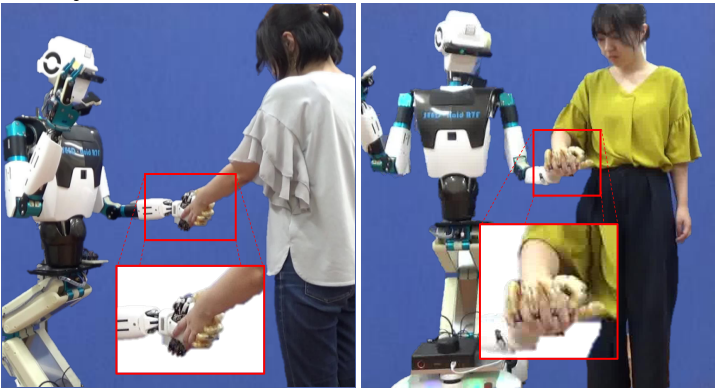
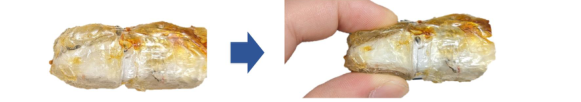
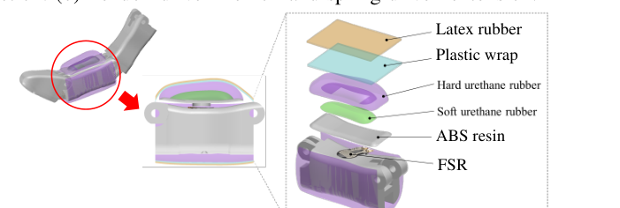
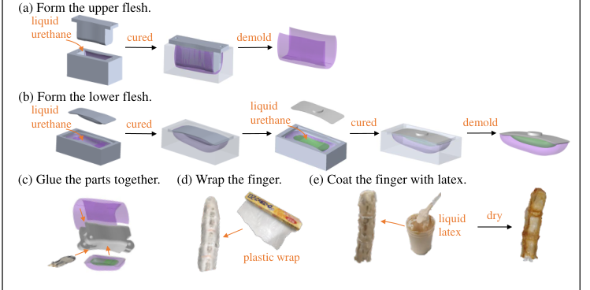
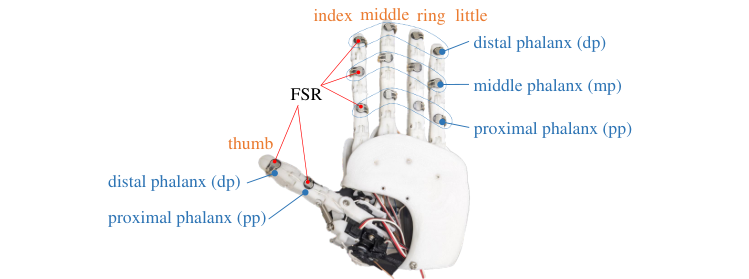
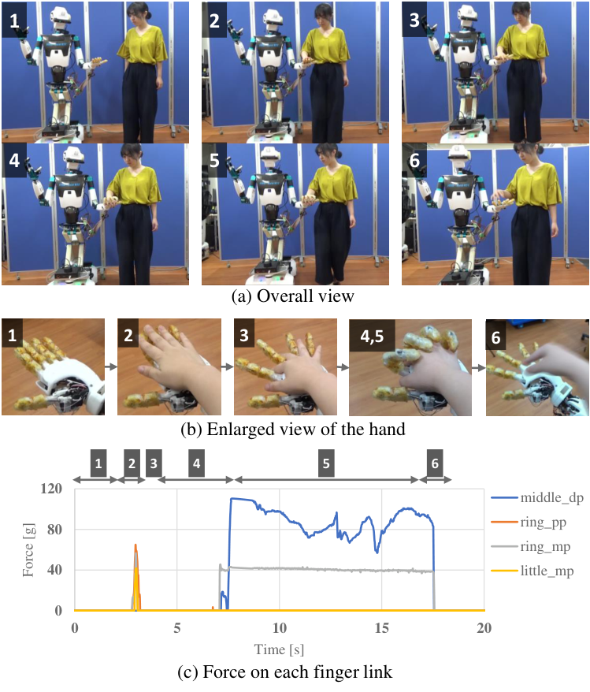
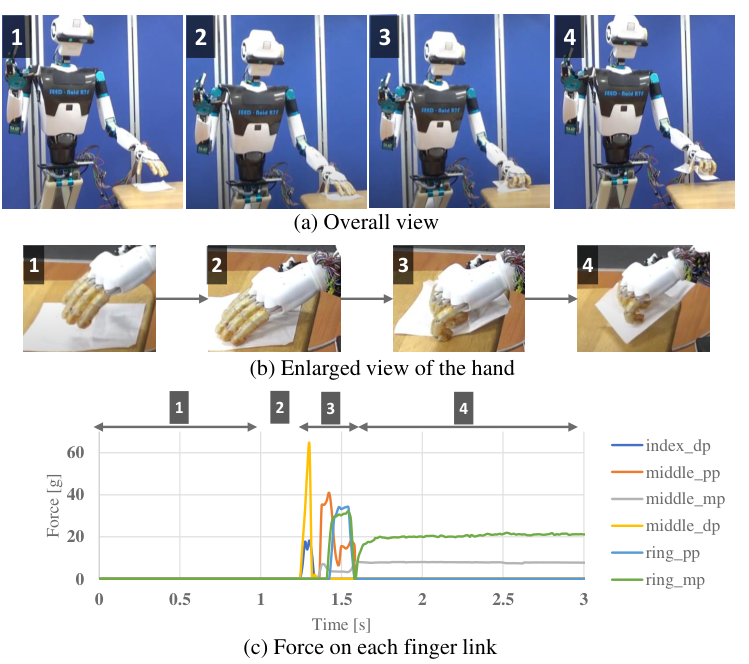

## 研究背景
人同士の手の接触には、痛みを和らげたり相手への好感を高めたりする心理的な効果があり、ロボットとの手繋ぎでもストレス軽減などの効果が報告されています。
しかし、人と手を繋ぐためのハンドには、人のように細く柔らかい指・接触状態を知るための触覚・手を包み込む自由度を、ハンド単体の限られたスペースに収める必要があり、これらを両立したハンドは実現されていませんでした。

以前開発したハンド（[近接・力覚で握り状態を推定する五指ロボットハンド]()）による手繋ぎの印象評価では、「ごつごつしていて握ると痛そう」「手を握りつぶされそう」といった不安の声が多く寄せられました。
そこで本研究では、人が触れたくなるような柔らかい外装と、人との接触を検知して握る力を調整する触覚を備えた、人と同程度のサイズの五指ロボットハンド「WARABI Hand」を開発しました（重さ約320g、手首までに全機構を収めて既存ロボットに装着可能）。

名前はデザインコンセプトである **W**arm-hearted・**A**nthropomorphic・**R**ubber skin・**A**nshin（安心）・Adjusta**B**le to human・**I**ntimate touch の頭文字であり、わらび餅のような心地よい触り心地への願いも込めています。

## 人の皮膚を模した多層ゴム外装
人の指腹の皮膚組織は表皮・真皮・皮下組織の3層からなり、表面に近いほど硬くなっています。また表皮は粘着性が小さく、細かな溝による適度な摩擦を持っています。
これにならい、**接触面に合わせて変形する柔らかい肉質**と、**変形を制限して肉質を保護する滑りやすい表皮**からなる外装を設計しました。

- **2種類のウレタンゴムによる肉質**：指腹には形が崩れやすいほど柔らかいウレタンゴムを封入し、その周囲と指の背側をやや硬いウレタンゴムで覆うことで、厚く柔らかい指腹と形状保持を両立
- **ラテックスによる表皮**：ウレタンゴムは表面の粘着性が高く触れたものに貼り付いてしまうため、液状ラテックスでコーティングして乾燥させ、べたつきが少なく滑らかな質感を実現
- **変形による接触面積の拡大**：押すと人の指のように変形して接触面積を増やし、接触圧を分散させることで、握ったときに相手へ痛みを与えにくい構造

外装は3Dプリントした型を用いて以下の手順で製作します。

1. 指背側・指腹側の肉質をそれぞれ型にウレタンゴムを流し込んで成形（指腹側は2種類のゴムを順に硬化）
2. 力覚センサと肉質を指骨格の各リンクに接着
3. 組み立てた指全体をラップフィルムで包み、ラテックスが骨格との隙間に浸入するのを防止
4. 液状ラテックスに浸して数日乾燥させると、表面の粘着性が消えて心地よい手触りに

## 外装越しに接触を検知する力覚センサ
人の手を握るとき、握り始めは指先ではなく掌に近い部分から力がかかり、指先に力がかかれば十分に指が曲がったと判断できます。そこで、接触の有無だけでなく接触面にかかる力を部位ごとに知るため、**各指リンクの腹側に力覚センサ**を配置しました。

- **FSRの採用**：赤外線式の近接センサは非透明の外装を透過できないため、圧力で抵抗値が変化するフィルム状の感圧センサ（FSR）を採用。四指は3リンク、母指は2リンクの計14個を搭載し、配線はすべて指の内部を通して手首まで引き回すことで細い指を維持
- **力の伝達構造**：柔らかい外装の上からかかる力をセンサに伝えるため、センサと外装の間に突起付きの樹脂板を挟み、骨格と外装の接触範囲をセンサの直上に限定。センサの感圧範囲（20〜2039g）は、人の指を秤に載せたときの重さ（約20g）程度のやさしい接触を捉えられるように選定
- **接触判定と握力調整**：いずれかのセンサに1.04g以上の力がかかると接触とみなし、握る際は指先のセンサが反応した時点で屈曲を止めることで、必要以上の力で握り込まないように制御

## 人・物体との接触実験
WARABI Handをヒューマノイドロボット SEED-Noid（THK）の左腕に装着し、センサ値に基づいて以下の5種類の動作を行いました。

### 人との手繋ぎ
- **前腕を掴む**：差し出された人の前腕にハンドを近づけ、中指の基節（middle pp）の反応で接触を検知。示指・中指の指先が反応するまで屈曲し、適度な力で前腕を把持
- **指を組む（恋人繋ぎ）**：差し出したハンドに人が手を重ねると、環指・小指のセンサで検知して指の間を広げ、中指の指先が反応するまで屈曲。人の指と互い違いに指を組んだまま、人を前方へエスコートした後に手を離す
- **握手**：お辞儀をしてハンドを差し出し、人が手を合わせたことを検知して握り返し、上下に2回振って握手

### 物体の把持と受け渡し
- **紙を拾う**：机上の紙を母指で押さえながら他の指を曲げると、摩擦によって紙が巻き込まれるように把持され、ハンドを持ち上げても落とさずに保持
- **ボトルを振る**：人が手に載せたペットボトルを検知して握り、縦向きにして上下に振った後、人がボトルを引っ張る力を基節のセンサで検知して手を開き、人に手渡し

これらの実験により、センサが反応した時点で屈曲を止めることで人や物体を必要以上の力で握らずに済むこと、また物の受け渡しを含む人とのインタラクションにハンドが有用であることを示しました。

## 考察と今後の展望
- **センサの反応性の偏り**：中指・環指のセンサが特に反応しやすく、四指での把持には十分であったものの、指切りのような多様なインタラクションには他の指の反応も必要。腱の連結方法や、製作時のセンサの取り付け方・繰り返し把持による外装状態の変化が要因と考えられ、人が手袋に慣れるように、自身の身体など既知の物体に定期的に触れて反応性の変化を較正する仕組みが有効と考えられる
- **接触前の予測**：近接センサを搭載すれば接触前から人の動きを予測でき、力覚センサでは捉えられない皮膚表面のせん断方向の微小な擦れも検知することで、互いの動きに合わせて同時に手を繋ぐ、より安心感のある手繋ぎが期待される
- **心理的な評価**：「柔らかく心地よい触り心地」は主観的なものであり、ハンドの心理的な寄与の評価が今後の課題

## 研究の流れ（関連論文・第一著者）

1. 中根葵, 矢野倉伊織, 長谷川峻, 小島邦生, 岡田慧, 稲葉雅幸: 接触面に合わせて変形可能な柔軟被覆と触覚を有する手繋ぎのための五指ロボットハンドの開発. *日本ロボット学会学術講演会*, 1E3-05, 2023.
2. **A. Nakane**, I. Yanokura, S. Hasegawa, N. Yamaguchi, K. Kojima, K. Okada, M. Inaba: [WARABI Hand: Five-fingered Robotic Hand with Flexible Skin and Force Sensors for Social Interaction](https://doi.org/10.1109/ICRA57147.2024.10610697). *IEEE International Conference on Robotics and Automation (ICRA)*, pp.18120-18126, 2024.
