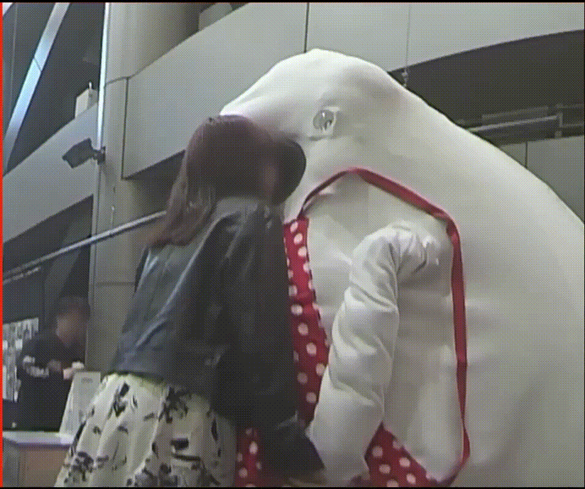
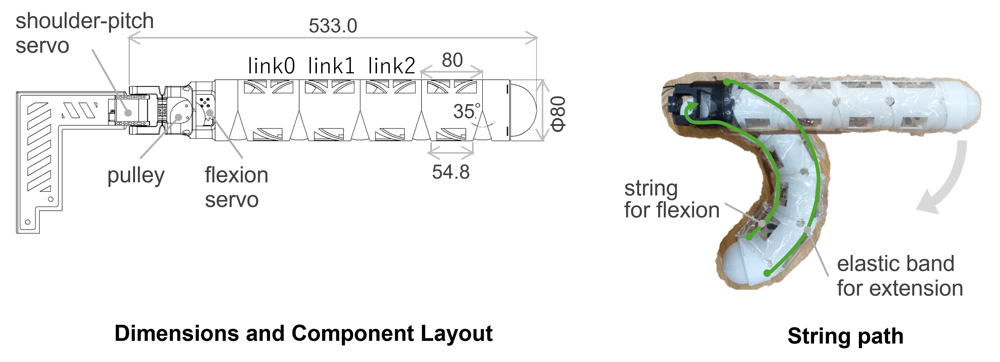
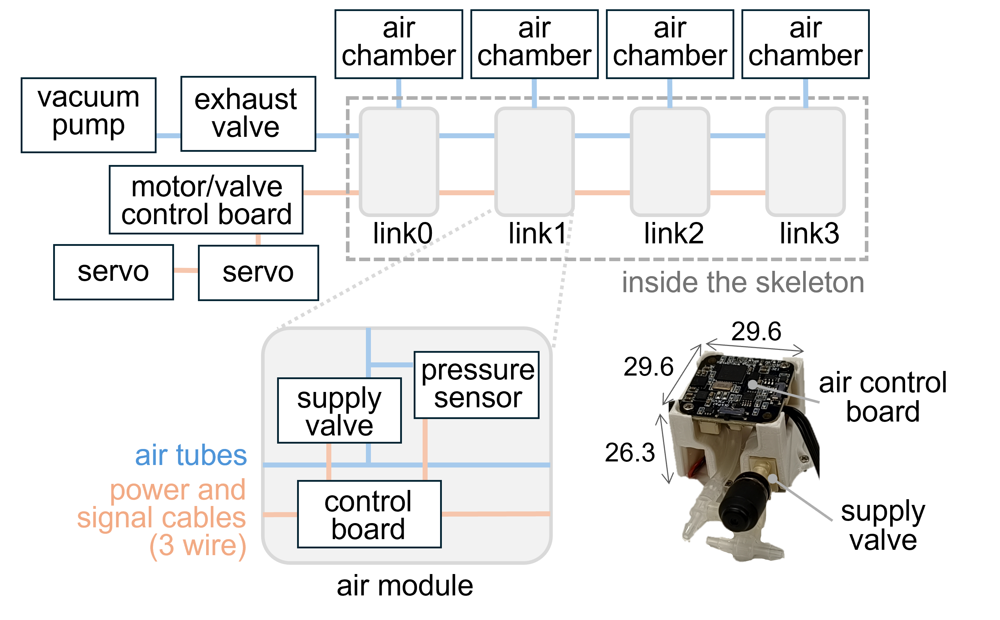
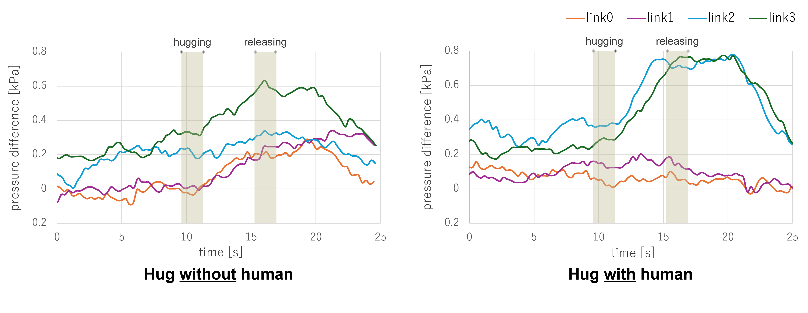
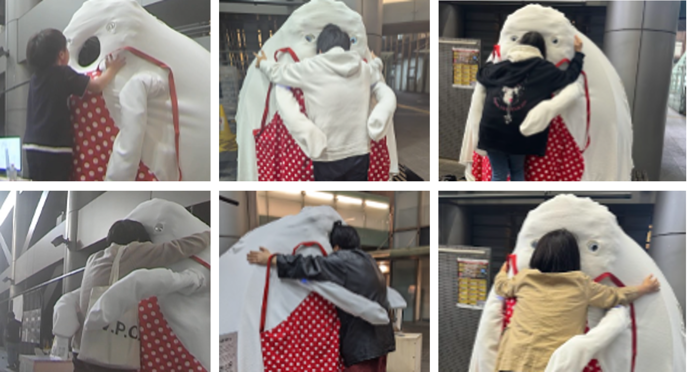

# バックグラウンドストーリーを持つハグロボット「umoru」

umoruは、人がロボットに”埋もれる”ことで、物理的・心理的な一体感を与える体験をコンセプトとしたハグロボットです。
このプロジェクトでは、人をやさしく高密着で抱きしめるためのロボットアームの開発を担当しました。

## 研究背景
本研究では、柔らかさの調整や接触検知が可能な空気外装を採用しています。
しかし、従来のハグロボットアームには汎用的な動作との間に次の2つのトレードオフが存在していました。

1. 密着性の低下: 自由度を増やすほど個々のリンクが長くなり、人の体の丸みに沿った滑らかな屈曲が困難
2. 安全性の低下: 骨格内部がアクチュエータ等で埋まっているため、空気チューブを骨格外に配管する設計が多く、ハグ時の破損や動作干渉リスクがある

そこで、密着性の低下に対しては「骨格の短円節化」、安全性の低下に対しては「配管配策の骨格内蔵」を提案します。

## ワイヤ駆動による骨格の短円節化
以下の工夫により、長さ80mmの短いリンクを連ねた5関節での滑らかな屈曲を実現しました。

- アーム根元に搭載した1つのモータからワイヤで動力を伝達し、5関節を同時に屈曲させる劣駆動方式とすることで、各リンクの搭載部品を削減
- 駆動自由度をハグにおいて重要な肩の上下動作と抱きしめるための屈曲動作に限定し、長手方向にねじれる回転をなくすことで内部機構の複雑化を防止

## シリアル配管配索の短円節骨格への内蔵

各空気袋を制御するモジュールを各リンクに分散配置し、直列に連結する方式を提案します。従来多く見られる集中配置型は電磁弁やチューブの径がボトルネックになりにくく応答性に優れる一方、空気袋の数だけ根元からチューブを伸ばす必要があり骨格への内蔵が難しく、関節の動きを阻害する恐れもありました。これに対し本研究の分散配置型では、リンク間を通る空気チューブが常に1本で済むため、配管を大幅にスリム化し短円節骨格への内蔵を可能にしています（ただし排気用電磁弁を複数の空気袋で共有するため、排気に時間を要する点はトレードオフです）。
この分散配置を実現するため、給気用電磁弁・気圧センサ・マイコンを実装した基板をまとめた「小型空気圧モジュール」を開発し、各リンクに搭載することで空気袋ごとの内圧を個別制御できるようにしました。さらに、関節を駆動するサーボとこのモジュールの駆動電圧・通信パケット形式を統一することで、全モジュールを3本の線で数珠つなぎに接続でき、配線量も削減しています。

## 空気外装による接触検知

ハグの内側に人が居る場合と居ない場合での空気外装の内圧を比較したところ、以下の違いがみられ、圧力の増減パターンによって接触検知できることを確認しました。
- 人が居ない状態（左）: ハグ時にアームが最後まで曲がりきるため、空気袋同士が自己干渉し、全てのリンクで圧力が増加
- 人が居る状態（右）: link2, 3では人との直接接触により圧力が増加する一方で、胴体に近いlink0とlink1では人の身体によってアームの屈曲が妨げられ、圧力が減少

<video width="90%" controls>
  <source src="figs/umoru4.mp4" type="video/mp4">
  Your browser does not support the video tag.
</video>

## 東京大学制作展での体験型展示

[東京大学制作展2024](https://2024-main.pages.dev/?workId=umoru)にて5日間umoruを展示し、来場者との交流体験を実施しました。
事後アンケートでは、107人中31人が印象的な場面として体験中にハグされたことに言及し、「ホールド力が強くて驚いた」、「機械的な固さでなく柔らかい感触だったため新鮮な感情が起こった」、「包まれるような感覚で安心感を感じた」といった内容が見られました 。
これらの結果から、本研究で開発したアームによるやさしく包み込むハグが、人々に驚きや、ロボットから受け入れられるという安心感を与え、豊かな情動体験に繋がった可能性が示唆されます 。

### 関連研究
- 中根葵, 澤田智佳, 宮道彩乃, 山口直也, 矢野倉伊織, 岡田慧: バックグラウンドストーリーを持つハグロボット「umoru」の研究3: 人をやさしく抱きしめる短円節から構成される連続屈曲アームの設計と開発. *日本ロボット学会学術講演会*, 1J4-03, 2025.
- 澤田智佳, 宮道彩乃, 中根葵, 矢野倉伊織, 岡田慧: バックグラウンドストーリーを持つハグロボット「umoru」の研究4：体験創出と印象評価. *日本ロボット学会学術講演会予稿集*, 1J4-04, 2025.
